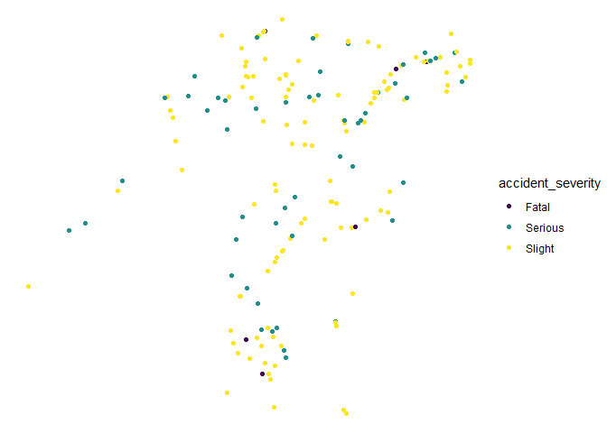

``` r
# remotes::install_cran("stats19")
remotes::install_github("ropensci/stats19")
```

    Using GitHub PAT from the git credential store.

    Skipping install of 'stats19' from a github remote, the SHA1 (bebbc131) has not changed since last install.
      Use `force = TRUE` to force installation

``` r
library(stats19)
```

    Data provided under OGL v3.0. Cite the source and link to:
    www.nationalarchives.gov.uk/doc/open-government-licence/version/3/

``` r
library(tidyverse)
```

    ── Attaching core tidyverse packages ──────────────────────── tidyverse 2.0.0 ──
    ✔ dplyr     1.1.4     ✔ readr     2.1.5
    ✔ forcats   1.0.0     ✔ stringr   1.5.1
    ✔ ggplot2   3.5.1     ✔ tibble    3.2.1
    ✔ lubridate 1.9.3     ✔ tidyr     1.3.1
    ✔ purrr     1.0.2     

    ── Conflicts ────────────────────────────────────────── tidyverse_conflicts() ──
    ✖ dplyr::filter() masks stats::filter()
    ✖ dplyr::lag()    masks stats::lag()
    ℹ Use the conflicted package (<http://conflicted.r-lib.org/>) to force all conflicts to become errors

``` r
collisions_2023 = get_stats19(year = 2023)
```

    Files identified: dft-road-casualty-statistics-collision-2023.csv

       https://data.dft.gov.uk/road-accidents-safety-data/dft-road-casualty-statistics-collision-2023.csv

    Data saved at C:\Users\GEORL_~1\AppData\Local\Temp\Rtmp0g9ICH/dft-road-casualty-statistics-collision-2023.csv

    Reading in: 

    C:\Users\GEORL_~1\AppData\Local\Temp\Rtmp0g9ICH/dft-road-casualty-statistics-collision-2023.csv

    date and time columns present, creating formatted datetime column

``` r
names(collisions_2023)
```

     [1] "accident_index"                             
     [2] "accident_year"                              
     [3] "accident_reference"                         
     [4] "location_easting_osgr"                      
     [5] "location_northing_osgr"                     
     [6] "longitude"                                  
     [7] "latitude"                                   
     [8] "police_force"                               
     [9] "accident_severity"                          
    [10] "number_of_vehicles"                         
    [11] "number_of_casualties"                       
    [12] "date"                                       
    [13] "day_of_week"                                
    [14] "time"                                       
    [15] "local_authority_district"                   
    [16] "local_authority_ons_district"               
    [17] "local_authority_highway"                    
    [18] "first_road_class"                           
    [19] "first_road_number"                          
    [20] "road_type"                                  
    [21] "speed_limit"                                
    [22] "junction_detail"                            
    [23] "junction_control"                           
    [24] "second_road_class"                          
    [25] "second_road_number"                         
    [26] "pedestrian_crossing_human_control"          
    [27] "pedestrian_crossing_physical_facilities"    
    [28] "light_conditions"                           
    [29] "weather_conditions"                         
    [30] "road_surface_conditions"                    
    [31] "special_conditions_at_site"                 
    [32] "carriageway_hazards"                        
    [33] "urban_or_rural_area"                        
    [34] "did_police_officer_attend_scene_of_accident"
    [35] "trunk_road_flag"                            
    [36] "lsoa_of_accident_location"                  
    [37] "enhanced_severity_collision"                
    [38] "datetime"                                   

``` r
# https://data.dft.gov.uk/road-accidents-safety-data/dft-road-casualty-statistics-collision-2023.csv
vehicles_2023 = get_stats19(year = 2023, type = "vehicle")
```

    Files identified: dft-road-casualty-statistics-vehicle-2023.csv

       https://data.dft.gov.uk/road-accidents-safety-data/dft-road-casualty-statistics-vehicle-2023.csv

    Data saved at C:\Users\GEORL_~1\AppData\Local\Temp\Rtmp0g9ICH/dft-road-casualty-statistics-vehicle-2023.csv

    Warning: The following named parsers don't match the column names:
    accident_severity, carriageway_hazards, collision_index, collision_reference,
    collision_year, date, day_of_week, did_police_officer_attend_scene_of_accident,
    did_police_officer_attend_scene_of_collision, enhanced_collision_severity,
    first_road_class, first_road_number, junction_control, junction_detail,
    latitude, legacy_collision_severity, light_conditions,
    local_authority_district, local_authority_highway,
    local_authority_ons_district, location_easting_osgr, location_northing_osgr,
    longitude, lsoa_of_accident_location, lsoa_of_collision_location,
    number_of_casualties, number_of_vehicles, pedestrian_crossing_human_control,
    pedestrian_crossing_physical_facilities, police_force, road_surface_conditions,
    road_type, second_road_class, second_road_number, special_conditions_at_site,
    speed_limit, time, trunk_road_flag, urban_or_rural_area, weather_conditions,
    age_band_of_casualty, age_of_casualty, bus_or_coach_passenger, car_passenger,
    casualty_class, casualty_distance_banding, casualty_home_area_type,
    casualty_imd_decile, casualty_reference, casualty_severity, casualty_type,
    enhanced_casualty_severity, lsoa_of_casualty, pedestrian_location,
    pedestrian_movement, pedestrian_road_maintenance_worker, sex_of_casualty,
    adjusted_serious, adjusted_slight, injury_based, accident_ref_no,
    effective_date_of_change, previously_published_value, replacement_value,
    variable

    Warning in asMethod(object): NAs introduced by coercion
    Warning in asMethod(object): NAs introduced by coercion

``` r
casualties_2023 = get_stats19(year = 2023, type = "casualty")
```

    Files identified: dft-road-casualty-statistics-casualty-2023.csv

       https://data.dft.gov.uk/road-accidents-safety-data/dft-road-casualty-statistics-casualty-2023.csv

    Data saved at C:\Users\GEORL_~1\AppData\Local\Temp\Rtmp0g9ICH/dft-road-casualty-statistics-casualty-2023.csv

    Warning: The following named parsers don't match the column names:
    accident_severity, carriageway_hazards, collision_index, collision_reference,
    collision_year, date, day_of_week, did_police_officer_attend_scene_of_accident,
    did_police_officer_attend_scene_of_collision, enhanced_collision_severity,
    first_road_class, first_road_number, junction_control, junction_detail,
    latitude, legacy_collision_severity, light_conditions,
    local_authority_district, local_authority_highway,
    local_authority_ons_district, location_easting_osgr, location_northing_osgr,
    longitude, lsoa_of_accident_location, lsoa_of_collision_location,
    number_of_casualties, number_of_vehicles, pedestrian_crossing_human_control,
    pedestrian_crossing_physical_facilities, police_force, road_surface_conditions,
    road_type, second_road_class, second_road_number, special_conditions_at_site,
    speed_limit, time, trunk_road_flag, urban_or_rural_area, weather_conditions,
    adjusted_serious, adjusted_slight, injury_based, accident_ref_no,
    effective_date_of_change, previously_published_value, replacement_value,
    variable, age_band_of_driver, age_of_driver, age_of_vehicle, dir_from_e,
    dir_from_n, dir_to_e, dir_to_n, driver_distance_banding, driver_home_area_type,
    driver_imd_decile, engine_capacity_cc, escooter_flag, first_point_of_impact,
    generic_make_model, hit_object_in_carriageway, hit_object_off_carriageway,
    journey_purpose_of_driver, junction_location, lsoa_of_driver, propulsion_code,
    sex_of_driver, skidding_and_overturning, towing_and_articulation,
    vehicle_direction_from, vehicle_direction_to, vehicle_leaving_carriageway,
    vehicle_left_hand_drive, vehicle_location_restricted_lane, vehicle_manoeuvre,
    vehicle_type
    Warning: NAs introduced by coercion

``` r
table(collisions_2023$local_authority_ons_district)
```


                          Aberdeen City                       Aberdeenshire 
                                     91                                 143 
                                   Adur                        Amber Valley 
                                    133                                 160 
                                  Angus                     Argyll and Bute 
                                    102                                 105 
                                   Arun                            Ashfield 
                                    281                                 212 
                                Ashford                             Babergh 
                                    307                                 129 
                   Barking and Dagenham                              Barnet 
                                    443                                 838 
                               Barnsley                            Basildon 
                                    371                                 227 
                  Basingstoke and Deane                           Bassetlaw 
                                    275                                 212 
           Bath and North East Somerset                             Bedford 
                                     76                                 332 
                                 Bexley                          Birmingham 
                                    396                                2199 
                                  Blaby               Blackburn with Darwen 
                                    121                                 297 
                              Blackpool                       Blaenau Gwent 
                                    279                                  48 
                               Bolsover                              Bolton 
                                    135                                 286 
                                 Boston Bournemouth, Christchurch and Poole 
                                    218                                 725 
                       Bracknell Forest                            Bradford 
                                    101                                1056 
                              Braintree                           Breckland 
                                    201                                 196 
                                  Brent                           Brentwood 
                                    917                                 140 
                               Bridgend                   Brighton and Hove 
                                     85                                 591 
                       Bristol, City of                           Broadland 
                                    809                                 167 
                                Bromley                          Bromsgrove 
                                    599                                 151 
                             Broxbourne                            Broxtowe 
                                    155                                 137 
                        Buckinghamshire                             Burnley 
                                    683                                 167 
                                   Bury                          Caerphilly 
                                    167                                 147 
                             Calderdale                           Cambridge 
                                    357                                 235 
                                 Camden                       Cannock Chase 
                                    727                                  64 
                             Canterbury                             Cardiff 
                                    292                                 293 
                        Carmarthenshire                        Castle Point 
                                    322                                  87 
                   Central Bedfordshire                          Ceredigion 
                                    580                                 168 
                              Charnwood                          Chelmsford 
                                    150                                 324 
                             Cheltenham                            Cherwell 
                                    158                                 174 
                          Cheshire East           Cheshire West and Chester 
                                    566                                 496 
                           Chesterfield                          Chichester 
                                    163                                 330 
                                Chorley                   City of Edinburgh 
                                    178                                 450 
                         City of London                    Clackmannanshire 
                                    174                                  22 
                             Colchester           Comhairle nan Eilean Siar 
                                    303                                  14 
                                  Conwy                            Cornwall 
                                    114                                1000 
                               Cotswold                       County Durham 
                                    222                                 464 
                               Coventry                             Crawley 
                                    393                                 266 
                                Croydon                          Cumberland 
                                   1103                                 427 
                                Dacorum                          Darlington 
                                    193                                 107 
                               Dartford                        Denbighshire 
                                    350                                 146 
                                  Derby                    Derbyshire Dales 
                                    494                                 201 
                              Doncaster     Dorset (excluding Christchurch) 
                                    559                                 662 
                                  Dover                              Dudley 
                                    225                                 431 
                  Dumfries and Galloway                         Dundee City 
                                    187                                 139 
                                 Ealing                       East Ayrshire 
                                    870                                 103 
                    East Cambridgeshire                          East Devon 
                                    142                                 220 
                    East Dunbartonshire                      East Hampshire 
                                     35                                 220 
                     East Hertfordshire                        East Lindsey 
                                    190                                 370 
                           East Lothian                   East Renfrewshire 
                                     83                                  68 
               East Riding of Yorkshire                  East Staffordshire 
                                    577                                  94 
                           East Suffolk                          Eastbourne 
                                    275                                 166 
                              Eastleigh                           Elmbridge 
                                    194                                 282 
                                Enfield                       Epping Forest 
                                    973                                 314 
                        Epsom and Ewell                             Erewash 
                                    160                                 171 
                                 Exeter                             Falkirk 
                                    159                                 117 
                                Fareham                             Fenland 
                                    182                                 150 
                                   Fife                          Flintshire 
                                    261                                 189 
                         Forest of Dean                               Fylde 
                                    142                                 169 
                              Gateshead                             Gedling 
                                    283                                 138 
                           Glasgow City                          Gloucester 
                                    567                                 214 
                                Gosport                           Gravesham 
                                     97                                 211 
                         Great Yarmouth                           Greenwich 
                                    144                                 602 
                              Guildford                             Gwynedd 
                                    356                                 146 
                                Hackney                              Halton 
                                    768                                 158 
                 Hammersmith and Fulham                          Harborough 
                                    585                                  95 
                               Haringey                              Harlow 
                                    972                                 101 
                                 Harrow                                Hart 
                                    403                                 144 
                             Hartlepool                            Hastings 
                                     89                                 174 
                                 Havant                            Havering 
                                    177                                 496 
               Herefordshire, County of                           Hertsmere 
                                    304                                 234 
                              High Peak                            Highland 
                                    134                                 259 
                             Hillingdon               Hinckley and Bosworth 
                                    631                                 116 
                                Horsham                            Hounslow 
                                    284                                 668 
                        Huntingdonshire                            Hyndburn 
                                    326                                 166 
                             Inverclyde                             Ipswich 
                                     33                                 181 
                       Isle of Anglesey                       Isle of Wight 
                                     53                                 233 
                        Isles of Scilly                           Islington 
                                      3                                 581 
                 Kensington and Chelsea        King's Lynn and West Norfolk 
                                    640                                 249 
            Kingston upon Hull, City of                Kingston upon Thames 
                                    692                                 275 
                               Kirklees                            Knowsley 
                                    722                                 214 
                                Lambeth                           Lancaster 
                                   1044                                 241 
                                  Leeds                           Leicester 
                                   1464                                 495 
                                  Lewes                            Lewisham 
                                    183                                 769 
                              Lichfield                             Lincoln 
                                    101                                 183 
                              Liverpool           London Airport (Heathrow) 
                                    931                                  19 
                                  Luton                           Maidstone 
                                    385                                 355 
                                 Maldon                       Malvern Hills 
                                    119                                 104 
                             Manchester                           Mansfield 
                                    638                                 180 
                                 Medway                              Melton 
                                    524                                  55 
                         Merthyr Tydfil                              Merton 
                                     46                                 433 
                              Mid Devon                         Mid Suffolk 
                                    116                                 134 
                             Mid Sussex                       Middlesbrough 
                                    292                                 175 
                             Midlothian                       Milton Keynes 
                                     79                                 293 
                            Mole Valley                       Monmouthshire 
                                    258                                  88 
                                  Moray                   Neath Port Talbot 
                                     37                                  93 
                             New Forest                 Newark and Sherwood 
                                    315                                 252 
                   Newcastle-under-Lyme                 Newcastle upon Tyne 
                                     75                                 469 
                                 Newham                             Newport 
                                    814                                 140 
                         North Ayrshire                         North Devon 
                                     98                                 153 
                  North East Derbyshire             North East Lincolnshire 
                                    140                                 337 
                    North Hertfordshire                      North Kesteven 
                                    166                                 244 
                      North Lanarkshire                  North Lincolnshire 
                                    243                                 369 
                          North Norfolk              North Northamptonshire 
                                    169                                 484 
                         North Somerset                      North Tyneside 
                                    263                                 251 
                     North Warwickshire           North West Leicestershire 
                                    197                                 111 
                        North Yorkshire                      Northumberland 
                                   1129                                 430 
                                Norwich                          Nottingham 
                                    206                                 724 
                  Nuneaton and Bedworth                   Oadby and Wigston 
                                    195                                  52 
                                 Oldham                      Orkney Islands 
                                    207                                  10 
                                 Oxford                       Pembrokeshire 
                                    237                                 193 
                                 Pendle                   Perth and Kinross 
                                    143                                 140 
                           Peterborough                            Plymouth 
                                    367                                 394 
                             Portsmouth                               Powys 
                                    463                                 338 
                                Preston                             Reading 
                                    363                                 260 
                              Redbridge                Redcar and Cleveland 
                                    631                                 128 
                               Redditch                Reigate and Banstead 
                                     72                                 310 
                           Renfrewshire                   Rhondda Cynon Taf 
                                    111                                 185 
                          Ribble Valley                Richmond upon Thames 
                                    101                                 375 
                               Rochdale                            Rochford 
                                    182                                 108 
                             Rossendale                              Rother 
                                     94                                 212 
                              Rotherham                               Rugby 
                                    437                                 184 
                              Runnymede                          Rushcliffe 
                                    255                                 167 
                               Rushmoor                             Rutland 
                                    139                                  29 
                                Salford                            Sandwell 
                                    265                                 574 
                       Scottish Borders                              Sefton 
                                    107                                 360 
                              Sevenoaks                           Sheffield 
                                    270                                 820 
                                Shepway                    Shetland Islands 
                                    219                                  18 
                             Shropshire                              Slough 
                                    348                                 237 
                               Solihull                            Somerset 
                                    261                                 791 
                         South Ayrshire                South Cambridgeshire 
                                     66                                 298 
                       South Derbyshire               South Gloucestershire 
                                    169                                 342 
                             South Hams                       South Holland 
                                    141                                 196 
                         South Kesteven                   South Lanarkshire 
                                    296                                 262 
                          South Norfolk                   South Oxfordshire 
                                    223                                 152 
                           South Ribble                 South Staffordshire 
                                    196                                 137 
                         South Tyneside                         Southampton 
                                    143                                 428 
                        Southend-on-Sea                           Southwark 
                                    272                                1026 
                             Spelthorne                           St Albans 
                                    247                                 284 
                             St. Helens                            Stafford 
                                    224                                 108 
                Staffordshire Moorlands                           Stevenage 
                                     80                                 126 
                               Stirling                           Stockport 
                                     86                                 197 
                       Stockton-on-Tees                      Stoke-on-Trent 
                                    215                                 191 
                      Stratford-on-Avon                              Stroud 
                                    214                                 158 
                             Sunderland                        Surrey Heath 
                                    324                                 184 
                                 Sutton                               Swale 
                                    355                                 324 
                                Swansea                             Swindon 
                                    158                                 405 
                               Tameside                            Tamworth 
                                    192                                  33 
                              Tandridge                         Teignbridge 
                                    239                                 201 
                     Telford and Wrekin                            Tendring 
                                    143                                 210 
                            Test Valley                          Tewkesbury 
                                    211                                 182 
                                 Thanet                        Three Rivers 
                                    285                                 135 
                               Thurrock               Tonbridge and Malling 
                                    269                                 279 
                                 Torbay                             Torfaen 
                                    190                                  79 
                               Torridge                       Tower Hamlets 
                                    110                                 999 
                               Trafford                     Tunbridge Wells 
                                    174                                 255 
                             Uttlesford                   Vale of Glamorgan 
                                    165                                  95 
                    Vale of White Horse                           Wakefield 
                                    151                                 648 
                                Walsall                      Waltham Forest 
                                    375                                 505 
                             Wandsworth                          Warrington 
                                   1041                                 313 
                                Warwick                             Watford 
                                    204                                 160 
                               Waverley                             Wealden 
                                    246                                 398 
                        Welwyn Hatfield                      West Berkshire 
                                    170                                 184 
                             West Devon                 West Dunbartonshire 
                                    119                                  55 
                        West Lancashire                        West Lindsey 
                                    172                                 217 
                           West Lothian               West Northamptonshire 
                                    141                                 749 
                       West Oxfordshire                        West Suffolk 
                                    118                                 211 
                            Westminster             Westmorland and Furness 
                                   1242                                 436 
                                  Wigan                           Wiltshire 
                                    222                                 948 
                             Winchester              Windsor and Maidenhead 
                                    273                                 189 
                                 Wirral                              Woking 
                                    401                                 203 
                              Wokingham                       Wolverhampton 
                                    170                                 455 
                              Worcester                            Worthing 
                                     75                                 224 
                                Wrexham                            Wychavon 
                                    129                                 150 
                                   Wyre                         Wyre Forest 
                                    196                                 102 
                                   York 
                                    314 

``` r
collisions_sf = format_sf(collisions_2023)
```

    12 rows removed with no coordinates

``` r
collisions_trafford = collisions_sf |>
  filter(str_detect(local_authority_ons_district, "Trafford")) 
```

``` r
# ggplot map:
ggplot() +
  geom_sf(data = collisions_trafford, aes(colour = accident_severity)) +
  scale_colour_viridis_d() +
  theme_void()
```


